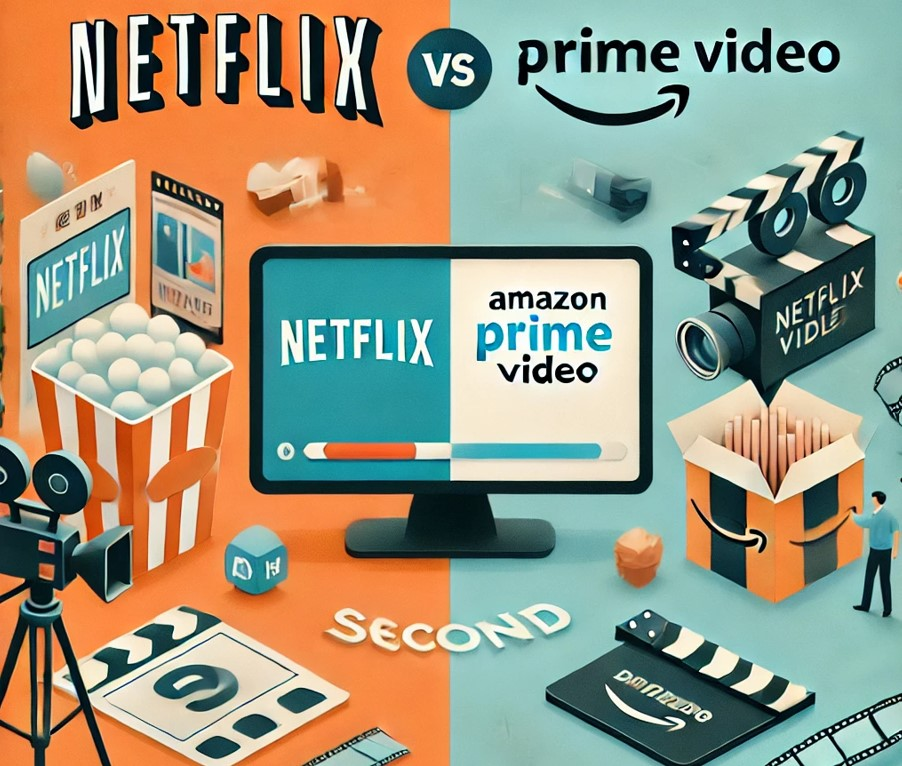

# 📹🎬 EDA Streaming Platforms 🎬📹

## TÍTULO
Streaming en España: Datos y Tendencias de Netflix y Amazon Prime Video

## DESCRIPCIÓN GENERAL
El objetivo del presente análisis es abordar las siguientes **hipótesis**, planteadas para los proveedores de Netflix y Amazon Prime Video a nivel nacional:

📈 **¿Ha incrementado el lanzamiento de series y películas en España a través de Netflix y Amazon Prime Video?** 📈

Para responder a esto, vamos a analizar la progresión a lo largo de los años de los estrenos al público de dichas ofertas de contenido audiovisual, para poder deducir que el **comportamiento de crecida y bajada** del **porcentaje de estrenos** tanto de **películas** como de **series** es bastante **similar** (si bien el porcentaje de las películas es bastante superior al de las series), y llegando a una **drástica caída** en el **estreno de producciones** en ambas plataformas en torno a los años **2022-2023** y que, **a día de hoy, se sigue reflejando.**

🎭 **¿Qué géneros predominan entre dichos proveedores de contenido?** 🎭

1. **¿Son los mismos en ambas plataformas? ¿Coinciden dichos géneros para series y películas?**

Podemos afirmar que el género más presente en ambos servicios, tanto para **series** como para **películas**, es el de **Drama**, seguido de **Comedia**.

2. **¿Existe alguna relación entre la nota de cada género y su porcentaje de presencia en las plataformas?**

· En cuanto a las películas...

... En **Netflix** hemos visto que, al contrario de lo que podíamos creer por los géneros predominantes en la plataforma, aquellos que tienen más calificación por parte de los usuarios no son aquellos de los que más productos (películas) hay, sino que los mejor valorados son los de **historia** y **documentales**, a pesar de que el porcentaje de presencia en la plataforma es bastante bajo.

... En **Amazon Prime Video** pasa algo similar que para Netflix: al contrario de lo que podíamos creer por los géneros predominantes, aquellos que tienen más calificación por parte de los usuarios no son aquellos de los que más productos (películas) hay, sino que los mejor valorados son los de **música** y **animación**, a pesar de que el porcentaje de presencia en la plataforma es bastante bajo.

· En cuanto a las series...

... En **Netflix**, los géneros de series más repetidos no son los que mejor nota media tienen (los más populares entre los usuarios son el de "Acción y Aventura" y el de "Ciencia Ficción y Fantasía"), cabe destacar que están bastante próximos 

... En **Amazon Prime Video**, los géneros de series más repetidos no son los más populares entre los usuarios: los mejor calificados son, igual que para Netflix, el de "Acción y Aventura" y el de "Ciencia Ficción y Fantasía", pero en el caso de Amazon, la diferencia en la nota media es mucho más notable

Además, hemos visto que las **notas medias** de los **géneros** para las **series** son **más elevadas** que para las **películas**.

## CONJUNTO DE DATOS
Los datasets empleados para realizar el estudio planteado se han obtenido a través de la [API de TMDB](https://developer.themoviedb.org/reference/intro/getting-started)

Gracias al procesamiento y análisis de estos datos hemos podido establecer unas conclusiones mediante una visión comparativa de las plataformas de streaming menciondas para nuestro país.

## ESTRUCTURA DEL REPOSITORIO
El repositorio consta de los siguientes archivos y carpetas:

➤[TMDB_Extraction.ipynb](./TMDB_Extraction.ipynb) 🠪 Explicación detallada para llevar a cabo la extracción vía API de TMDB mediante peticiones GET

➤[/data/](./data/) 🠪 Contiene todas las extracciones que se detallan en el documento anterior.

**Anotación:* Esta carpeta tiene también el listado de series y películas para más plataformas de streaming a nivel nacional para un futuro análisis/comparación entre todos esos proveedores (*Disney+/Max*) y los ya analizados (*Netflix/Amazon Prime Video*).

➤[/utils/](/EDA-Streaming-Platforms-Spain/utils/) 🠪 En dicha carpeta hemos incluido el archivo [tvseries.py](/EDA-Streaming-Platforms-Spain/utils/tvseries.py), en el que se define una función que agiliza la extracción de la información de las series y películas en la base de datos

➤[Analysis.ipynb](Analysis.ipynb) 🠪 Jupyter Notebook en el que describimos todos los pasos llevados a cabo a lo largo de la investigación, estructurado para abordar cada una de las hipótesis

➤[/images/](/EDA-Streaming-Platforms-Spain/images/) 🠪 Incluye el conjunto de imágenes que se han utilizado en los notebooks

## CÓMO EJECUTAR EL PROYECTO
𝟙.- Clonación del repositorio: Primero, necesitas clonar este repositorio en tu máquina local. Para hacerlo, abre una terminal y ejecuta el siguiente comando:

    git clone https://github.com/tacedo97/EDA-Streaming-Platforms-Spain.git

𝟚.- Navegación hasta el directorio donde clonaste el proyecto:

    cd EDA-Streaming-Platforms-Spain

𝟛.- Instalación de dependencias: Para poder ejecutar el análisis, necesitas tener Python y todas las librerías utilizadas a lo largo del estudio. En caso de que te falte alguna, deberás utilizar el comando 

    pip install nombre_libreria_faltante

𝟜.- Visualización: Abre en un Jupyter Notebook el archivo [Analysis.ipynb](Analysis.ipynb) y ejecuta las celdas para poder ver los gráficos y resultados obtenidos. Adicionalmente, podrás ver todos los comentarios realizados durante la investigación.